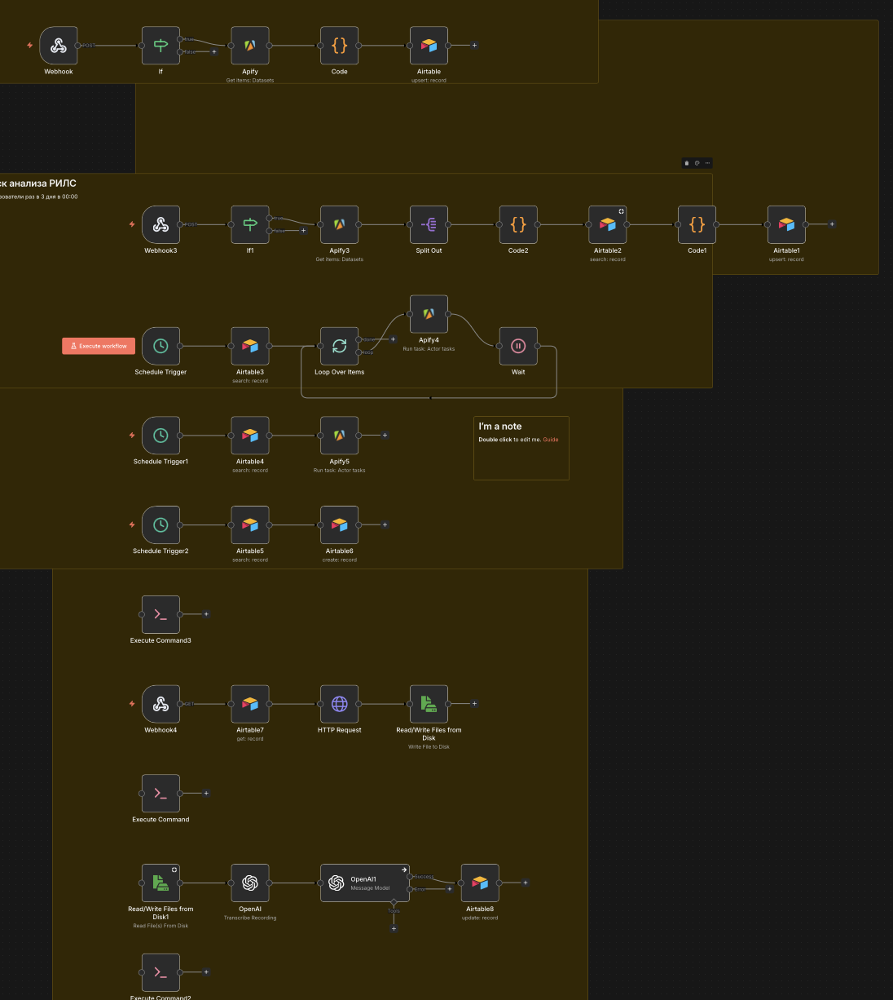

# AI Reels Analysis

AI Reels Analysis is an automation project for collecting short-form video references, generating transcripts, extracting structured insights, and creating reusable content research records. The system uses Apify, Airtable, Whisper, OpenAI, and n8n or Make.com to support repeatable content analysis workflows.

## Business Problem

Analyzing short-form video manually is time-intensive. A content operator may need to collect reel links, watch each video, write notes, transcribe speech, identify hooks, summarize the message, and turn observations into new content ideas. This process is repetitive and difficult to standardize.

The problem becomes larger when research volume increases. Notes are often inconsistent, source links are scattered, and useful examples are difficult to compare. Without structured storage, a team cannot easily search by topic, format, hook type, or content angle.

## Solution

This project automates the analysis pipeline for reels and similar short-form videos. Apify collects available public metadata and source data. Airtable stores each video record and workflow status. Whisper generates transcripts from accessible audio. OpenAI analyzes transcripts and metadata to produce structured research outputs.

The result is a searchable research database rather than a collection of disconnected notes. Human reviewers can inspect transcripts, adjust AI-generated analysis, and reuse the structured insights for future content planning.

## Architecture

```text
Reel URL / Source List
  ↓
Apify
  ↓
Make.com / n8n
  ↓
Airtable
  ↓
Whisper
  ↓
OpenAI
  ↓
Structured Analysis
  ↓
Airtable Review
```

## Workflow

1. A reel URL or source list is added to Airtable.
2. The automation sends the input to an Apify actor configured for public video metadata collection.
3. Returned metadata is saved to the related Airtable record.
4. The workflow checks whether an audio or media URL is available for transcription.
5. The audio is sent to Whisper.
6. Whisper returns a transcript of the spoken content.
7. The transcript is saved to Airtable.
8. OpenAI receives the transcript, caption, and metadata with a structured analysis prompt.
9. The AI output is mapped into fields such as summary, hook, format, topic, target audience, content angle, and reuse ideas.
10. Airtable status is updated to indicate that the record is ready for review.
11. Failed records are marked with a clear reason such as missing audio, blocked source, or transcription failure.
12. A reviewer edits or approves the analysis before using it in planning.

## Technologies

| Technology | Purpose |
| --- | --- |
| Apify | Public video data collection |
| Airtable | Research database and status tracking |
| Whisper | Audio transcription |
| OpenAI | Transcript analysis and content ideation |
| Make.com / n8n | Workflow orchestration |
| HTTP Requests | API communication |

## Features

- Reel URL intake and tracking
- Metadata collection through Apify
- Transcript generation with Whisper
- Structured AI analysis with OpenAI
- Airtable-based research library
- Status tracking for each processing stage
- Error handling for missing or inaccessible media
- Human review before insights are reused
- Reusable fields for content planning

## Business Value

The workflow reduces the manual effort required to analyze short-form content and creates a consistent research format. Instead of watching every reel and writing free-form notes, the user receives transcripts and structured analysis fields that can be filtered and compared.

The measurable benefit is faster research preparation and better reuse of content insights. A team can build a library of examples, hooks, formats, and ideas without relying on scattered notes or browser bookmarks.

## Future Improvements

- Add duplicate detection for repeated reel URLs
- Add scoring fields for hook strength and clarity
- Include prompt versioning for analysis consistency
- Generate content briefs from approved research records
- Add batch processing for source lists
- Build Airtable views for topic clusters and content formats
- Add notifications when new analysis is ready for review

## Repository Structure

```text
AI-Reels-Analysis/
├── README.md
├── assets/
│   └── workflow.png
└── workflows/
    └── workflow.json
```

## Screenshot



## Export

The workflow export is located inside:

```text
workflows/workflow.json
```

